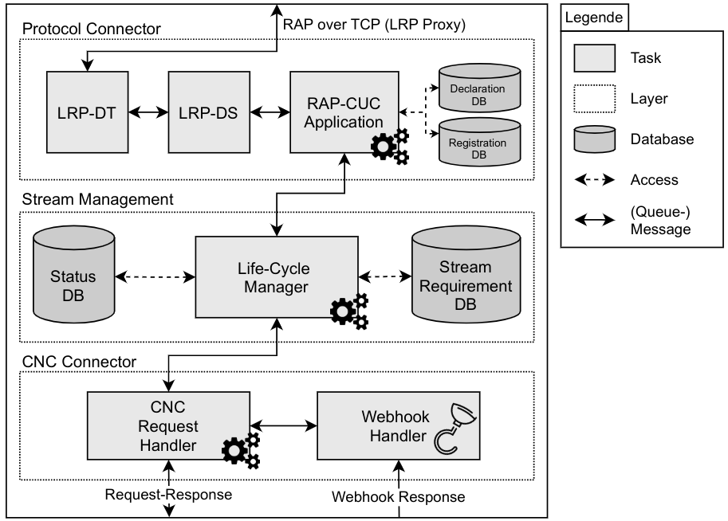

# RAP-CUC

This project implements a Central User Configuration entity (CUC) specific for the Resource Allocation Protocol, defined in IEEE Std 802.1Qdd. It can be used for the reservation of resources for streams in a Time-Sensitive Network (TSN) which uses the hybrid configuration model. 

## Architecture

This protoype does not implement the Link-local Registration Protocol (IEEE Std 802.1CS) and does not provide an implementation of a specific CNC-Connector.

